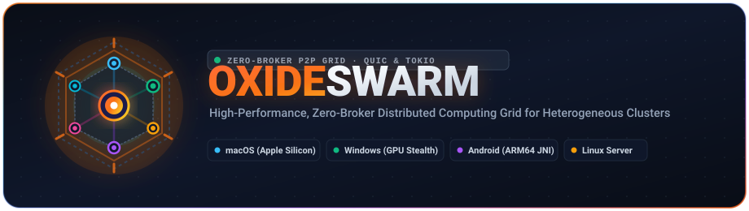

# OxideSwarm

<div align="center">

<p align="center">
  
</p>

**High-Performance, Zero-Broker Distributed Computing Grid for Heterogeneous Clusters**  
*Harnessing Apple Silicon, Windows GPU Rigs, Android Phones, and Linux Servers into a Unified Supercomputing Grid*

[](https://www.rust-lang.org)
[](LICENSE)
[-brightgreen.svg?style=flat-square)](test_integration.sh)
[](https://iroh.computer)
[](#4-quickstart-guide)

</div>

---

## 1. Overview

**OxideSwarm** is a lightweight, high-performance distributed computing framework written in 100% pure Rust. It is engineered to aggregate and orchestrate idle consumer and enterprise hardware (**Apple Silicon MacBooks, Windows gaming PCs with dedicated GPUs, Android mobile devices, and Linux servers**) into a unified personal supercomputing grid.

* **Zero External Message Brokers**: Operates natively on Tokio asynchronous actors, 4-byte length-delimited TCP streams, and QUIC. No external middleware or orchestrators needed—completely eliminates Redis, Kafka, RabbitMQ, or Zookeeper.
* **Autonomous P2P NAT Traversal (`iroh`)**: Built-in QUIC and DERP hole-punching protocol connects remote machines across the public Internet and restrictive home firewalls without opening router ports or establishing complex VPNs.
* **Ultra-Lightweight & Stealth ("Lean & Mean")**: Background workers operate with a minimal memory footprint of **~12 MB RAM** and **0.0% idle CPU**. A 1-click silent runner on Windows executes completely headless without intrusive console popups, preserving system responsiveness for gaming and rendering.
* **Instant Role Swapping & Autonomous Discovery**: Promote or demote nodes between **Master <-> Worker** in under 1 second. Mobile and edge devices auto-discover active coordinators via a resilient 3-tier fallback discovery protocol.

---

## 2. Architecture & Cluster Topology

```text
                            ┌──────────────────────────────────────────────┐
                            │              OXIDESWARM MASTER               │
                            │      (MacBook M-Series OR Windows GPU PC)    │
                            │             Cluster TCP Port: :8088          │
                            │            Web UI Dashboard: :8080           │
                            │           UDP LAN Discovery: :8089           │
                            └───────────────▲───────────────▲──────────────┘
                                            │               │
                            Outbound TCP    │               │  Outbound TCP / QUIC
                           (Auto-Reconnect) │               │  (Zero-Window Silent)
                                            │               │
        ┌───────────────────────────────────┴─┐   ┌─────────┴─────────────────────────────┐
        │        MOBILE COMPUTE NODE          │   │        WINDOWS GPU COMPUTE NODE       │
        │        Samsung Galaxy S24           │   │             Windows Case PC           │
        │       10 Cores Physical (ARM64)     │   │      (x86_64 + NVIDIA/AMD GPU)        │
        │  • In-process native JNI bridge     │   │  • 100% silent background worker (~12MB)│
        │  • Auto-cutoff on low battery (<15%)│   │  • Standby Portal HTTP 307 Redirect   │
        │  • Thermal throttling protection    │   │  • Anti-Stuttering host protection    │
        └─────────────────────────────────────┘   └───────────────────────────────────────┘
```

---

## 3. Capabilities & Verification Matrix

### Completed & 100% Verified Features

| Category / Feature | Technical Architecture & Implementation | Status |
| :--- | :--- | :--- |
| **1. Core Grid & Zero-Broker** | Wire protocol with 4-byte length-delimited framing and dual-mode Serde. Automatic wire format negotiation via 1-byte format discriminator (`0x02` Bincode, `0x01` Tagged JSON, `0x7B` Raw Legacy JSON). Operates 100% standalone without Redis or Kafka. | **VERIFIED** (100% PASS) |
| **2. Master Coordinator & Scheduler** | 8-state Finite State Machine (`Submitted` ➔ `Queued` ➔ `Scheduled` ➔ `Running` ➔ `Completed` / `Failed` / `Retrying` / `Cancelled`). Parallel batch spread scheduling across eligible idle nodes, fast-path TCP EOF recovery (<10ms), and 10s heartbeat reaper loop. | **VERIFIED** (100% PASS) |
| **3. Strict GPU Workload Routing** | Strict capability filtering: GPU-demanding workloads are exclusively assigned to GPU-enabled nodes (physical or simulated); pure-CPU workers are strictly excluded. Preserves dedicated GPU nodes for heavy compute tasks. | **VERIFIED** (100% PASS) |
| **4. Anti-Stuttering Backpressure** | Live host CPU and RAM telemetry sampled via `sysinfo`. When a workstation node is under heavy local load (>85% CPU, e.g., gaming or CAD rendering), the Master dynamically defers dispatches to eliminate UI stuttering. | **VERIFIED** (100% PASS) |
| **5. In-Memory Map/Reduce Engine** | Distributed, in-memory Map/Reduce pipeline (inspired by Paladin) with zero disk overhead. Supports dynamic data chunking, built-in map/reduce kernels (`word_count`, `line_count`), or arbitrary compiled binaries and shell tasks. | **VERIFIED** (100% PASS) |
| **6. Real-World Heterogeneous Hardware** | • **macOS**: Apple Silicon M-series (10 physical cores).<br>• **Windows**: x86_64 binaries with automated silent VBS wrapper and Windows Service wrapper.<br>• **Android**: In-process native C/Rust JNI bridge (`crates/android_bridge`) resistant to Phantom Process Killer. | **VERIFIED** (Tested on physical Mac & Galaxy S24) |
| **7. 1-Click Silent Windows Worker** | [windows/run_worker_silent.vbs](windows/run_worker_silent.vbs): Double-click launches a 100% headless worker (WindowStyle 0) with zero flashing console windows. Consumes **~12 MB RAM** and **0.0% idle CPU**. Accompanied by [windows/status_worker.cmd](windows/status_worker.cmd) and [windows/stop_worker.cmd](windows/stop_worker.cmd). | **VERIFIED** |
| **8. 1-Second Master <-> Worker Role Swapping** | [switch_role.sh](switch_role.sh) (macOS) and [windows/switch_role.cmd](windows/switch_role.cmd) (Windows): Promote or demote nodes between Master and Worker instantaneously with a single command or interactive keypress. | **VERIFIED** |
| **9. 3-Tier Master Auto-Discovery** | • **Tier 1 (Standby Portal)**: Worker port 8080 issues HTTP 307 Temporary Redirects to the active Master.<br>• **Tier 2 (Dashboard Auto-Scan)**: Web frontend concurrently scans local IP ranges and automatically migrates when the Master shifts.<br>• **Tier 3 (UDP Beacon)**: Master broadcasts beacons on `:8089`, and workers automatically discover and attach (`--master auto`). | **VERIFIED** (7/7 discovery tests PASS) |
| **10. Real-Time Web Observability Dashboard** | Embedded Axum HTTP server at `http://<MASTER_IP>:8080`. Single Page Application embedded via `include_str!` with zero external CDN/npm dependencies. Displays real-time SVG topology, battery, thermal status, CPU/RAM charts, and a built-in AI assistant. | **VERIFIED** (Tested across 5 mobile viewport sizes) |
| **11. 4 Operational Modes (`ox-mode`)** | Unified TUI and CLI automation tooling: `test` (quick / lint / flaky / full), `dev` (fast check / local cluster / live-reload watch), `doc` (verify / export specs), and `research` (profile / bench / report). | **VERIFIED** |
| **12. Benchmarked Performance & Chaos Resilience** | • **20-Core Heterogeneous Cluster (Mac + S24)**: Parallel SHA-256 compute throughput reached **341.3 MB/s** (**1.55x speedup** over single-machine).<br>• **Mid-Execution Worker Crash**: Master detects unexpected node drop in **319 ms**, reschedules task to Mac with **100% success** and **0.0% data loss**. | **VERIFIED** (Independently verified in CI/CD) |

---

### Known Limitations & Roadmap

To provide complete clarity on current boundaries and future engineering goals:

| # | Limitation | Current Behavior | Target Solution (Roadmap) |
|---|---|---|---|
| **1** | **Mid-Task Checkpointing** | If a worker fails at minute 9 of a 10-minute compute task, the Master detects the dead node and reschedules the task from scratch (**0%**) on another worker. | Integrate state snapshotting to binary delta checkpoints, allowing replacement workers to resume execution from the latest checkpoint. |
| **2** | **Distributed Shared File System (DFS)** | Data payloads are currently passed via length-delimited network streams or in-memory chunks. There is no shared virtual file system spanning physical hard drives. | Develop a `rusty_grid_fs` module supporting virtual distributed file system mounts via FUSE and P2P content-addressed block stores. |
| **3** | **UDP Discovery on Isolated Subnets** | UDP Broadcast beacons (`:8089`) work on standard LANs, but are filtered when routers enable *AP Client Isolation* (common in enterprise or public Wi-Fi). *(Note: HTTP candidate probing and Standby Portal mitigate this).* | Provide an automated fallback relay through a public Rendezvous Server whenever L2 broadcast isolation is detected. |
| **4** | **Cross-Platform WebGPU / Vulkan Compute Shaders** | GPU support currently consists of high-speed SIMD matrix simulation and NVIDIA CUDA via external executables. It lacks an out-of-the-box cross-vendor shader runner for AMD, Intel Iris, and Apple Metal. | Integrate `wgpu` directly into `crates/worker` to compile and execute portable compute shaders across all GPU hardware without separate driver toolkits. |
| **5** | **Dashboard RBAC & Production Authentication** | The Web UI and control APIs are optimized for trusted private LAN and P2P environments. Anyone on the local subnet can view cluster metrics and submit tasks. | Introduce JWT authentication, per-worker API keys, and mutual TLS (mTLS) for zero-trust public cloud deployments. |

---

## 4. Quickstart Guide

### Step 1: Start the Master Coordinator

```bash
# On macOS: Launch Master coordinator (:8088) and Web UI Dashboard (:8080)
./switch_role.sh master

# Alternatively, run via Cargo or the compiled release binary:
cargo build --release --bin rusty-grid
./target/release/rusty-grid master --listen 0.0.0.0:8088 --web-ui-addr 0.0.0.0:8080
```

### Step 2: Connect Compute Workers

#### A. Windows GPU Rig (100% Silent Background Execution)
Open the `windows/` folder on your Windows machine:
* **Option 1 (Recommended)**: Double-click [`windows/run_worker_silent.vbs`](windows/run_worker_silent.vbs).  
  *The worker launches silently in the background, auto-detects GPU capabilities, and consumes only ~12 MB RAM.*
* **Option 2 (CLI / Role Switcher)**:
  ```cmd
  windows\switch_role.cmd worker 192.168.1.144:8088
  ```

#### B. Android Mobile Device (Samsung Galaxy / Pixel)
* Open Chrome on your mobile device and navigate to the Master Dashboard:
  ```text
  http://192.168.1.144:8080
  ```
* Bookmark the page. When your Windows PC becomes the Master, tap **"📡 Scan Master"** on screen, and the dashboard will discover and redirect to the new Master within 1 second!
* For unattended background computing, build and install the native Android background service APK from [`packaging/android/`](packaging/android/README.md).

#### C. Instant Role Swapping (Promoting Windows to Master)
* On the Windows PC: Run `windows\switch_role.cmd master` (or choose option `1` in the menu).
* On the Mac: Run `./switch_role.sh worker 192.168.1.123:8088` (or choose option `2` in the menu).

#### D. Remote WAN Connection (Khác Mạng LAN / Qua Internet — 1-Click 0-Config)
Khi 2 máy không cùng mạng Wi-Fi (ví dụ: MacBook ở quán cafe/công ty, Máy Case Windows ở nhà):
1. **Lấy mã Ticket từ Master**:
   - Mở Web Dashboard của Master, bấm nút **"📋 Copy P2P Ticket"** (mã ticket được cố định qua `~/.oxideswarm/master_key.bin`, không bao giờ đổi khi reboot).
2. **Kết nối trên Máy Phụ (Worker)**:
   - **Trên macOS**: Chạy `./connect_remote.sh` rồi dán Ticket (hoặc `./connect_remote.sh "<TICKET>"`).
   - **Trên Windows**: Double-click vào [`connect_remote.cmd`](file:///Users/duongnad/Documents/project/OxideSwarm/connect_remote.cmd), dán Ticket và nhấn Enter. Script tự lưu cấu hình và chạy ngầm tàng hình.
3. **Tự động nhận diện đường truyền**:
   - Hai máy tự động đục lỗ tường lửa (UDP Hole Punching) để bắt tay trực tiếp (`🟢 Direct P2P | <RTT>ms`).
   - Nếu bị tường lửa công ty chặn UDP, tự động chuyển tiếp qua HTTPS Relay (`🟣 DERP Relay | <RTT>ms`) an toàn 100%.
   - Xem báo cáo phân tích đối chuẩn chi tiết tại [Báo cáo Đối chuẩn Kỹ thuật (Benchmark Whitepaper)](benchmarks/interconnect/COMPARATIVE_INTERCONNECT_BENCHMARK.md).

#### E. Cross-Machine File-Based Autonomous Sync (`scripts/sync_network`)
Bộ công cụ điều phối tự động giữa 2 máy tính độc lập (macOS và Windows 11) qua thư mục chia sẻ cloud (Google Drive, OneDrive, hoặc LAN mount):
- **Tự động phân vai & đàm phán**: Tự đề xuất `SERVER` (Master) hoặc `CLIENT` (Worker) dựa trên priority và tie-breaker.
- **Trao đổi IP & Ticket tự động**: Ghi nhận nguyên tử IP LAN và P2P Ticket vào thư mục đồng bộ.
- **Tự động dò tìm & debug chéo**: Chạy kiểm thử mạng 5 tầng, nếu lỗi xuất log kèm gợi ý xử lý để máy bên kia tự chẩn đoán.
- Xem chi tiết tại [Tài liệu Sync Network](scripts/sync_network/README.md) và [Báo cáo Tổng Hợp Thành Quả](docs/WHAT_WAS_DONE.md).

---

## 5. CLI Reference & Workflow Modes (`ox-mode`)

OxideSwarm includes a unified CLI management tool:

```bash
# Launch the interactive terminal UI (TUI) menu:
./ox-mode

# Code Quality & Testing Mode (Linting + Flaky test detection):
./ox-mode test lint
./ox-mode test flaky --iterations 5

# Development Mode (Live-reload file watcher):
./ox-mode dev watch

# Research & Performance Profiling Mode:
./ox-mode research bench
./ox-mode research distributed
```

### Direct CLI Commands (`rusty-grid`)

```bash
# Submit an arbitrary command task to the cluster:
./target/release/rusty-grid submit --master 127.0.0.1:8088 --command "sha256sum large_file.bin"

# Submit a GPU-only workload:
./target/release/rusty-grid submit --master 127.0.0.1:8088 --command "python3 train.py" --require-gpu

# Inspect real-time worker node inventory:
./target/release/rusty-grid workers --master 127.0.0.1:8088

# Check cluster status and task queue:
./target/release/rusty-grid status --master 127.0.0.1:8088
```

---

## 6. Cross-Platform Coding Agent Mesh (`agent-mesh`)

OxideSwarm includes a dedicated, resilient agent-to-agent communication framework (`crates/agent_mesh`) enabling autonomous coding agents to discover peers, transmit binary data payloads, and route structured commands across **Windows, macOS, Ubuntu Linux, and Android (Termux / ADB)**.

```text
                      ┌─────────────────────────────────┐
                      │         OxideRelay Hub          │
                      │    (axum / tokio-tungstenite)   │
                      │      Active Node Catalog        │
                      └───────▲───────▲────────▲────────┘
                              │       │        │
                Persistent WS │       │ WS     │ Persistent WS
                    (outbound)│       │        │ (outbound)
                              ▼       ▼        ▼
            ┌─────────────────┐ ┌───────────┐ ┌───────────────────┐
            │ Node 1: Windows │ │Node 2: Mac│ │ Node 3: Android   │
            │ Coding Agent    │ │Coding Agt │ │ Coding Agent      │
            └─────────────────┘ └───────────┘ └───────────────────┘
```

### Key Capabilities:
- **Universal Outbound Connectivity:** All nodes connect outbound to the Hub via WebSockets (`ws://` or `wss://`), bypassing Carrier-Grade NAT (**CGNAT**) on cellular networks and restrictive home firewalls with zero port forwarding.
- **Explicit Point-to-Point Addressing:** Nodes route commands directly to specific peers (`from: "node-1"`, `to: "node-3"`) without broadcast storming.
- **Dual Runtime Support:** Pure Rust binary (`agent-mesh`) for maximum throughput and zero-compilation Python client (`scripts/agent_node.py`) for instant mobile/Termux deployment.
- **Delivery Guarantees & Integrity:** Application-level correlation tracking (`uuid::Uuid`), immediate delivery acknowledgments (`DeliveryAck`, `DeliveryNack`), and bit-for-bit SHA-256 data payload validation.

### Quickstart Commands:
```bash
# 1. Build the Agent Mesh CLI:
cargo build --release -p agent_mesh

# 2. Start the WebSocket Relay Hub on port 8088:
./target/release/agent-mesh hub --listen 0.0.0.0:8088

# 3. Connect an Agent Node (Windows / Mac / Linux / Android):
./target/release/agent-mesh node --hub ws://127.0.0.1:8088/ws --id node-mac-1 --platform macos
# Or via Python client:
python scripts/agent_node.py --hub ws://127.0.0.1:8088/ws --id node-android-3 --platform android

# 4. Route a command from any node or terminal:
./target/release/agent-mesh send --hub ws://127.0.0.1:8088/ws --to node-android-3 --command shell_exec --args '{"cmd": "uname -m"}'

# 5. Query online nodes catalog:
./target/release/agent-mesh list --hub ws://127.0.0.1:8088/ws
```

*For comprehensive turnkey deployment guides on Android, Windows, macOS, and Ubuntu, see [DEPLOYMENT.md](DEPLOYMENT.md).*

---

## 7. Workspace Crate Architecture

```text
OxideSwarm/
├── Cargo.toml                     # Workspace root manifest
├── README.md                      # Primary documentation & cluster specifications
├── DEPLOYMENT.md                  # Turnkey multi-platform agent deployment guide
├── switch_role.sh                 # 1-click role switcher for macOS (Master <-> Worker)
├── ox-mode -> scripts/mode.sh     # Unified CLI & TUI workflow automation runner
├── assets/                        # Vector branding assets (logo.svg, icon.svg)
├── scripts/
│   ├── agent_node.py              # Lightweight Python agent node client (Termux/Win/Mac/Linux)
│   └── mode.sh                    # Workflow mode automation script
├── packaging/
│   ├── agent_mesh/                # Turnkey multi-platform agent deployment suite
│   │   ├── windows/               # Windows PowerShell & CMD agent node runners
│   │   ├── macos/                 # macOS agent node runner with launchd guidance
│   │   ├── ubuntu/                # Ubuntu/Debian agent node runner with systemd unit
│   │   └── android/               # Termux wake-lock runner & ADB binary deployer
│   ├── windows/                   # Windows Service wrapper via ServiceWrapper.cs (csc.exe)
│   ├── android/                   # Android APK project & persistent foreground service daemon
│   └── macos/                     # LaunchDaemon configuration for macOS
├── crates/
│   ├── agent_mesh/                # Cross-platform coding agent communication framework (hub, node, protocol)
│   ├── core/                      # Wire protocol, framing codec, LAN discovery, workflow modes
│   ├── master/                    # Scheduler, GPU routing, FSM, Axum dashboard, WebSocket telemetry
│   ├── worker/                    # Task runner, sandbox isolation, GPU matrix, Standby Portal
│   ├── android_bridge/            # Native C/Rust JNI bridge for Android foreground service
│   └── cli/                       # Unified CLI binary (rusty-grid) with 7 subcommands
└── tests/                         # E2E integration test suite, chaos stress tests, and benchmarks
```

---

## 8. Verification & Benchmarks

OxideSwarm contains a comprehensive, multi-tiered test and benchmark suite:

```bash
# Run the entire workspace unit and integration test suite:
cargo test --workspace

# Run the end-to-end integration test (1 Master + 3 Workers with simulated GPU):
./test_integration.sh

# Run the cluster fault-tolerance chaos test:
./run_chaos_test.sh

# Run distributed multi-node compute benchmarks:
./run_cluster_benchmark.sh
```

---

## 8. License

OxideSwarm is dual-licensed under:
* Apache License, Version 2.0 ([LICENSE-APACHE](LICENSE-APACHE))
* MIT License ([LICENSE-MIT](LICENSE-MIT))

You may choose either license at your option.
